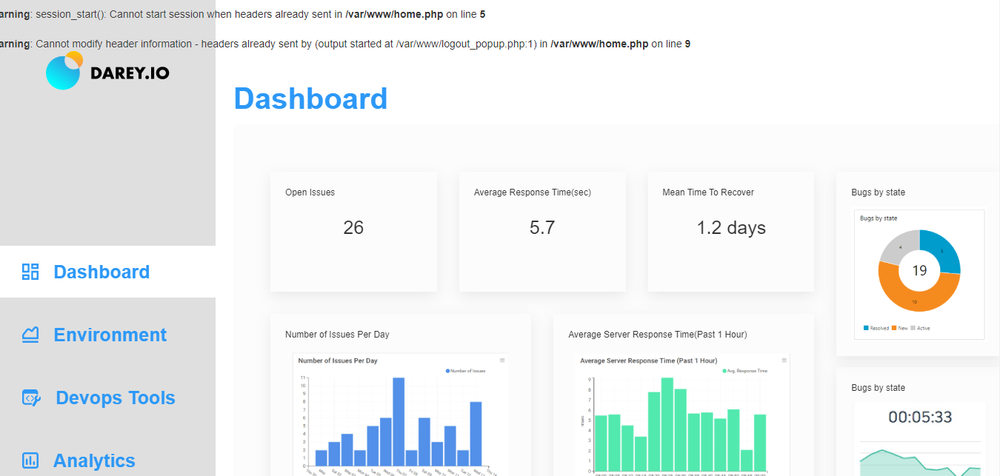

# DOCUMENTATION OF PROJECT 20

1. I launched an ubuntu OS Linux server and updated it
   
   
   

2. I installed the necessary dependencies
   
   
   

3. Then I installed docker
   
   
   

4. I pulled MYSQL image from docker hub registry

    `docker pull mysql/mysql-server:latest`

    

5. I deployed the MYSQL container to my docker engine and I confirmed if it is running

`docker run --name <container_name> -e MYSQL_ROOT_PASSWORD=<my-secret-pw> -d mysql/mysql-server:latest`
     `docker ps -a`

6. I created a docker network named "tooling_app_network" then I confirmed if it has been created

    `sudo docker network create --subnet=172.18.0.0/24 tooling_app_network && sudo docker network ls`

    

7. I exported my password then I pulled the image and run the container

     `export MYSQL_PW=  && docker run --network tooling_app_network -h mysqlserverhost --name=mysql-server -e MYSQL_ROOT_PASSWORD=$MYSQL_PW  -d mysql/mysql-server:latest `

     

8. I craeted a file named "create_user.sql" and I updated it with the necessary command

    

    `sudo touch create_user.sql  && sudo vi create_user.sql`

    

9. Then I ran the script and it worked. 
     `docker exec -i mysql-server mysql -uroot -p$MYSQL_PW < create_user.sql `

     

10. I ran the MYSQL client container

      `docker run --network tooling_app_network --name mysql-client -it --rm mysql mysql -h mysqlserverhost -u  -p`

      
      

11. I cloned the toolong-app repository

    

12. Then I exported the tooling-database file
    
    

13. I used the 'SQL' script to create a database

     `docker exec -i mysql-server mysql -uroot -p$MYSQL_PW < $tooling_db_schema`

     

14. Then I edited the '.env' file 

    

15. I built the app and I ran the container

   `docker build -t tooling:0.0.1 . `

   `docker run --network tooling_app_network -p 8085:80 -it tooling:0.0.1 `

   

  

16. I opened the link on my browser and it connected successfully

   
   